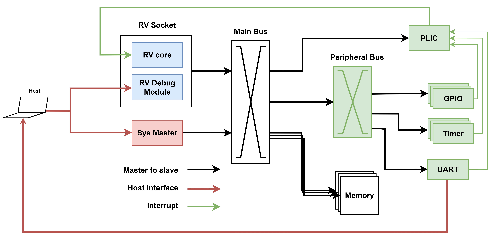

# UninaSoC
RISC-V soft-SoC extensible plaftorm for Xilinx FPGAs from University of Naples Federico II.
> NOTE: the name is temporary...

## Environment and Tools Version
This project was verified on Ubuntu 22.04 and the following tools version:
| Tool            | Verified version |
|-----------------|------------------|
| Vivado          | 2023.2*-2024.2   |
>\* `CORE_MICROBLAZEV` is supported only in Vivado >= 2024.2

## SoC Profiles
The SoC comes in two flavors, `hpc` and `embedded` profiles, and support for multiple boards.

Supported boards and associated profiles are:

| Profile                  | Board
|--------------------------|--------------------------
| `embedded` (Default)     | [Nexys A7-100T](https://digilent.com/reference/programmable-logic/nexys-a7/reference-manual) (Default)
| `embedded`               | [Nexys A7-50T](https://digilent.com/reference/programmable-logic/nexys-a7/reference-manual)
| `hpc`                    | [Alveo U250](https://www.amd.com/en/products/accelerators/alveo/u250/a-u250-a64g-pq-g.html)

Further support is coming soon for:
- [Zybo](https://digilent.com/reference/programmable-logic/zybo/reference-manual)
- [ZCU102](https://www.xilinx.com/products/boards-and-kits/ek-u1-zcu102-g.html)
- [Alveo U50](https://docs.amd.com/r/en-US/ug1371-u50-reconfig-accel)
- [Alveo U280](https://docs.amd.com/r/en-US/ug1314-alveo-u280-reconfig-accel)

## Build and Run:
The top-level `Makefile` can be used to build the platform for the specific target board.

First, setup environment with:
```
source settings.sh <soc_config> <board>
```
> NOTE: If no input parameter is specificed, we default to `embedded` profile and the Nexys A7-100T board.

Build defaults with

```
make all
```

Alternatively, you can control the individual steps.

1. Configure the SoC:
```
make config # This is always called when operating from the top Makefile
```

2. Download rtl sources for non-xilinx IPS:
```
make units
```

3. Build the SoC bitstream by running:
```
make xilinx
```

4. Build software examples with:
```
make sw
```

## Architecture

In both HPC and embedded profiles, the SoC architecture and host connection is depicted below:



The host connects to a RISC-V debug module through JTAG and a `Sys Master` AXI master module, allowing for direct control and read-back over the main bus.

### Profiles:
UninaSoC supports the following profiles `embedded` adn `hpc`.

Physical resources depend on the target board and part number. W.r.t. the default supported boards, the platform offers:
- Profile `embedded` on Nexys-A7-100T:
   - UART: physical peripheral requires a [physical FTDI connection](hw/xilinx/doc/UART_CONNECTION.md)
   - Memory: 8KB BRAM + 128MB DDR (TBD)
   - `Sys Master`: through JTAG Xilinx `hw_server`
- Profile `hpc` on Alveo U250:
   - UART: virtualized over PCIe.
   - Memory: 8KB BRAM + 16GB DDR (per DDR channel)
   - `Sys Master`: through PCIe BAR addres space.

## Documentation Index

Finer-grained documentation and insights to control the building flow, can be found below:
1. [Configuration flow](config/README.md): re-configure UninaSoC.
2. Hardware build:
   - [Hardware units](hw/units/README.md): prepare external custom IPs.
   - [Xilinx FPGA](hw/xilinx/README.md): package IPs, build bitstream, and device programming and debug flow.
3. [Software build](sw/README.md): build software for UninaSoC.
4. Simulation (TBD):
   * Unit tests: Verilator
      * Royalty-free, good for students
      * No support for Xilin IPs
   * SoC-level tests, QuestaSim:
      * Requires license
      * Supports Xilinx IPs
      * Students can access a licensed host for simulator access

