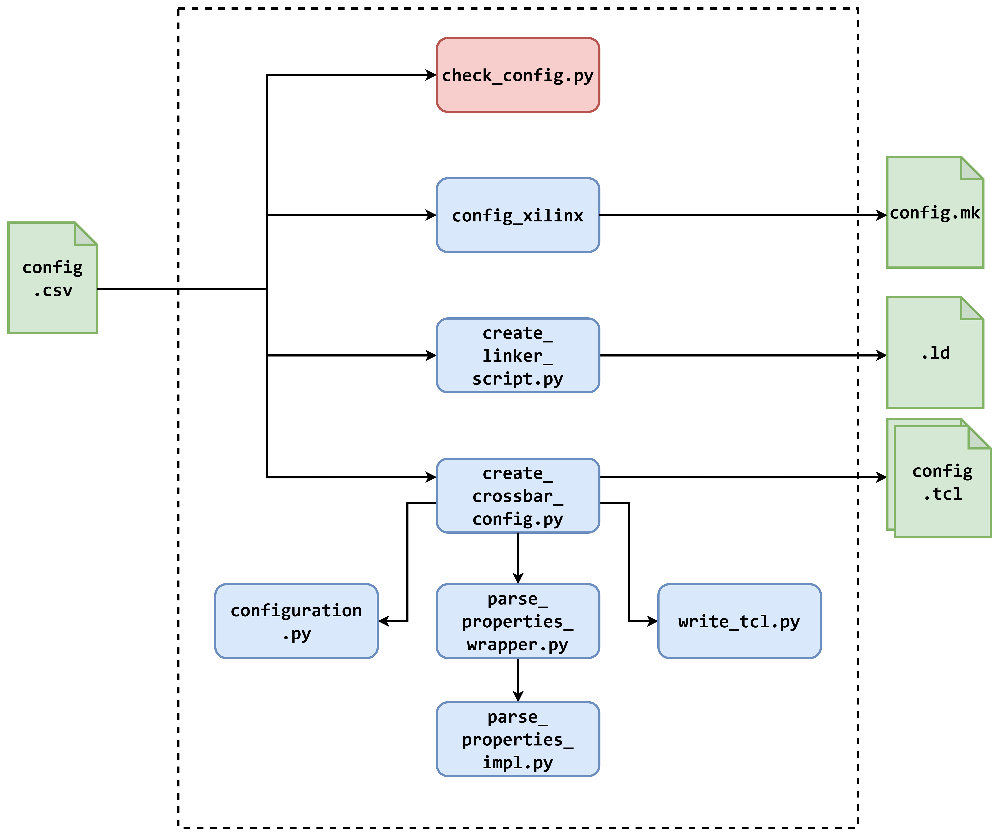

#  AXI Crossbar Configuration Generator
This tree allows for the automatic generation of the AXI crossbar IP and linker script for software development.

## Prerequisites and Tools versions
This tree has been verified with the following tools and versions
* Vivado 2022.2 - 2024.2
* AXI Interconnect v2.1
* Pyhton >= 3.10
* Pandas >= 2.2.3

##  Configuration file format
The input configuration files are CSV files. These files are under the configs directory structured as follows:
``` bash
configs
├── common                           # Config files shared between hpc and embedded
│   ├── config_system.csv            # System-level configurations
├── embedded                         # Config files for embedded
│   ├── config_main_bus.csv          # Main bus config file
│   └── config_peripheral_bus.csv    # Peripheral bus config file
└── hpc                              # Config files for hpc
    ├── config_main_bus.csv          # Main bus config file
    └── config_peripheral_bus.csv    # Peripheral bus config file
```

A configuration file can either refer to system-level options or to a specific bus. For now only main bus and peripheral bus are supported, **but file names must match those above**.

In each file, each row of the file holds a property name and value pair.
Some properties are array, with elements separated by a white space " " character.

The following table details the supported properties.

### System Configuration

> **IMPORTANT NOTE**: XLEN parameter will only affect main bus sizes. Other buses (such as the peripheral bus) will have a hardcoded DATA_WIDTH and ADDRESS_WIDTH value.

| Name  | Description | Values | Default
|-|-|-|-|
| CORE_SELECTOR         | Select target RV core (**only for main_bus**)             | CORE_PICORV32*, CORE_CV32E40P, CORE_IBEX, CORE_MICROBLAZEV | None (**mandatory value**)
| VIO_RESETN_DEFAULT    | Select value for VIO resetn (**only for main_bus**)       | [0,1]                                                     | 1
| XLEN                  | Defines Bus DATA_WIDTH, supported cores and Toolchain version             | [32,64]                                                 | 32
| PHYSICAL_ADDR_WIDTH   | Select the phyisical address width. If XLEN=32 it must equal 32. If XLEN=64, it must be > 32 | (32..64) | 32

> NOTE: the external PicoRV32 IP is currently bugged in CSR support. Any code running with CORE_PICORV32 must not perform any CSR operation.

### Bus Configuration

> **IMPORTANT NOTE**: the address range of a bus (child) that is a slave of another bus (parent), in its configuration (.csv) file, must be an absolute address range, this means that if the child bus is mapped in the parent bus at the address 0x1000 to 0x1FFF, then the peripherals in the child bus must be in the address range 0x1000 to 0x1FFFE

| Name  | Description | Values | Default
|-|-|-|-|
| PROTOCOL              | AXI PROTOCOL                                              | (AXI4, AXI4LITE, AXI3)                                    | AXI4
| CONNECTIVITY_MODE     | Crossbar Interconnection                                  | Shared-Address, Multiple-Data(SAMD), Shared-Address/Shared-Data(SASD)                | SAMD
| ID_WIDTH              | AXI ID Width                                              | (4..32)                                                   | 4
| NUM_MI                | Number of Master Interfaces (number of slaves)            | (0..16)                                                   | 2
| NUM_SI                | Number of Slave Interfaces (number of masters)            | (0..16)                                                   | 1
| MASTER_NAMES          | Names of masters connected to the bus                     | [NUM_SI] Strings | N/A
| RANGE_NAMES           | Names of slave memory ranges                                               | [NUM_MI] Strings                                          | N/A
| MAIN_CLOCK_DOMAIN     | Clock domain of the core + MBUS                           | (10, 20, 50, 100) for embedded. (10, 20, 50, 100, 250) for hpc | None
| RANGE_CLOCK_DOMAINS         | Clock domains of the slaves (RANGE_NAMES) of the MBUS | [NUM_MI] (10, 20, 50, 100, 250 hpc only)| Note: the BRAM, DM_mem, PLIC clock domain must be the same as MAIN_CLOCK_DOMAIN, while the DDR clock domain must have the same frequency of the DDR board clock (i.e. 300MHz)
| ADDR_RANGES           | Number of ranges for master interfaces                    | (1..16)                                                   | 1
| BASE_ADDR             | The Base Addresses for each range of each Master          | [NUM_MI*ADDR_RANGES] 64 bits hex                          | 0x100000 for the first range of every Master, otherwise is 0xffffffffffffffff [not used], it must be lesser or equal of Global ADDR_WIDTH
| RANGE_ADDR_WIDTH      | Number of bytes covered by each range of each Master      | [NUM_MI*ADDR_RANGES] (12..64) for AXI4 and AXI3, (1..64) for AXI4LITE | 12 for the first range of every Master, otherwise is 0 [not used]
| READ_CONNECTIVITY     | Master to slave read connectivity                         | [NUM_MI*NUM_SI] not enabled (0), enabled (1)              | 1
| WRITE_CONNECTIVITY    | Master to slave write connectivity                        | [NUM_MI*NUM_SI] not enabled (0), enabled (1)              | 1
| STRATEGY              | Implementation strategy                                   | Minimize Area (1), Maximize Performance (2)               | 0
| Slave_Priority        | Scheduling Slave Priorities                               | [NUM_SI] (0..16)                                          | 0 which is Round-Robin
| SI_READ_ACCEPTANCE    | Number of concurrent Read Transactions for each Slave     | [NUM_SI] (1..32)                                          | 2, only 1 with SASD [forced by STRATEGY, Connectivity Mode and R_REGISTER choices]
| SI_WRITE_ACCEPTANCE   | Number of concurrent Write Transactions for each Slave    | [NUM_SI] (1..32)                                          | 2, only 1 with SASD [forced by STRATEGY, Connectivity Mode and R_REGISTER choices]
| THREAD_ID_WIDTH       | Number of ID bits used for Thread ID for each Slave       | [NUM_SI] (0..32)                                          | 0 is default, at the moment it’s forced to 0
| SINGLE_THREAD         | Support for multiple Threads for each Slave               | [NUM_SI] Multiple Threads (0), Single Thread (1)          | 0
| BASE_ID               | ID Base value for each Slave                              | [NUM_SI] (0x0..0xffffffff)                                | N/A
| MI_READ_ISSUING       | Number of concurrent Read Transactions for each Master    | [NUM_MI] (1..32)                                          | 4, only 1 with AXI4LITE and AXI3 [forced by PROTOCOL]
| MI_WRITE_ISSUING      | Number of concurrent Write Transactions for each Master   | [NUM_MI] (1..32)                                          | 4, only 1 AXI4LITE and AXI3 [forced by PROTOCOL]
| SECURE                | SECURE Mode for each Master                               | [NUM_MI] Non-SECURE (0), SECURE (1)                       | 0
| R_REGISTER            | Read channel register slice                               | None (0), Full (1), Light(8), Automatic (8)               | 0, 1 only with SASD [forced by STRATEGY]
| AWUSER_WIDTH          | AXI AW User width                                         | (0..1024)                                                 | 0
| ARUSER_WIDTH          | AXI AR User width                                         | (0..1024)                                                 | 0
| WUSER_WIDTH           | AXI  W User width                                         | (0..1024)                                                 | 0
| RUSER_WIDTH           | AXI  R User width                                         | (0..1024)                                                 | 0
| BUSER_WIDTH           | AXI  B User width                                         | (0..1024)                                                 | 0

## Genenerate Configurations
After applying configuration changes to the target CSV files (`embedded` or `hpc`), apply though `make`.

Alternatively, you can control the generation of single targets:
``` bash
$ make config_check             # Preliminary sanity check for configuration
$ make config_main_bus          # Generates main bus config
$ make config_peripheral_bus    # Generates peripheral bus config
$ make config_ld                # Generates linker script
$ make config_xilinx            # Update xilinx config
$ make config_sw                # Update software config
```

### BRAM size configuration
The `config_xilinx` flow also configures the BRAM size of the IP `xlnx_blk_mem_gen` according to the `RANGE_ADDR_WIDTH` assigned to the BRAM in the CSV.

> **NOTE**: The xlnx_blk_mem_gen/config.tcl file configures the first BRAM occurrence, hence it uses the index 0. For now, a single BRAM is supported, if multiple BRAMs are declared in the config (CSV) file, the config flow gives an error. Multiple BRAMs would be simple to add in the future.

### Clock domains
The configuration flow gives the possibility to specify clock domains.
The `MAIN_CLOCK_DOMAIN` is the closk domain of the core and the main bus (`MBUS`). All the slaves attached to the `MBUS` can have their own clock domain. If a slave has a domain different from the `MAIN_CLOCK_DOMAIN`, it needs a `xlnx_axi_clock_converter` to cross the clock domains. In this case the configuration flow will set the `<SLAVE_NAME>_HAS_CLOCK_DOMAIN` (i.e. `PBUS_HAS_CLOCK_DOMAIN`) variable which informs that the slave has its own clock domain.

### VIO resetn default
The `VIO_RESETN_DEFAULT` parameter controls the programming-time value of core reset.
- `VIO_RESETN_DEFAULT = 1` (default): VIO resetn is non-active, the CPU starts running at programming-time, allowing debugging with DTM and GDB.
- `VIO_RESETN_DEFAULT = 0`:  VIO resetn is active, keeping the core in a reset state when the bitstream is programmed.

### Scripting Architecture
The directory `scripts/` holds multiple scripts, acting in the following scripting architecture:



The multiple scripts generate outputs from common inputs:
1. The Xilinx-related environment configuration in [`config.mk`](../hw/xilinx/make/config.mk) is handled by [`config_xilinx.sh`](scripts/config_xilinx.sh).
1. The software-related environment (including toolchain and compilation flags) configuration in [`config.mk`](../sw/SoC/common/config.mk) is handled by [`config_sw.sh`](scripts/config_sw.sh).
1. [Linker script](../sw/SoC/common/UninaSoC.ld) generation is handled solely by [`create_linker_script.py`](scripts/create_linker_script.py) source.
1. Configuration TCL files (for [MBUS](../hw/xilinx/ips/common/xlnx_main_crossbar/config.tcl) and [PBUS](../hw/xilinx/ips/common/xlnx_peripheral_crossbar/config.tcl)) for the platform crossbars are generated with [`create_crossbar_config.py`](scripts/create_crossbar_config.py) as master script.

### How to add a new property
In the table above, multiple properties are supported, but more can be added.
To add a new property:
1. In the target CSV file, e.g. `config_main_bus.csv`, add the new key-value pair.
2. In file `configuration.py`, add the new property to the config class. Name must match the key in `config_main_bus.csv`.
3. In file `parse_properties_wrapper.py`, file add a case that composes the new function call.
4. In file `parse_properties_impl.py`, add a function that handles the new property:
    - how it is parsed.
    - how it is sanitized.
    - how it updates the `configuration` structure.
5. In file `create_crossbar_config.py` file, after the loop setting the `configuration` structure,
create the tcl property string and add it to the list of commands, which will then be flushed on the output file.
6. If necessary, add new checks in the `check_config.py` script.
