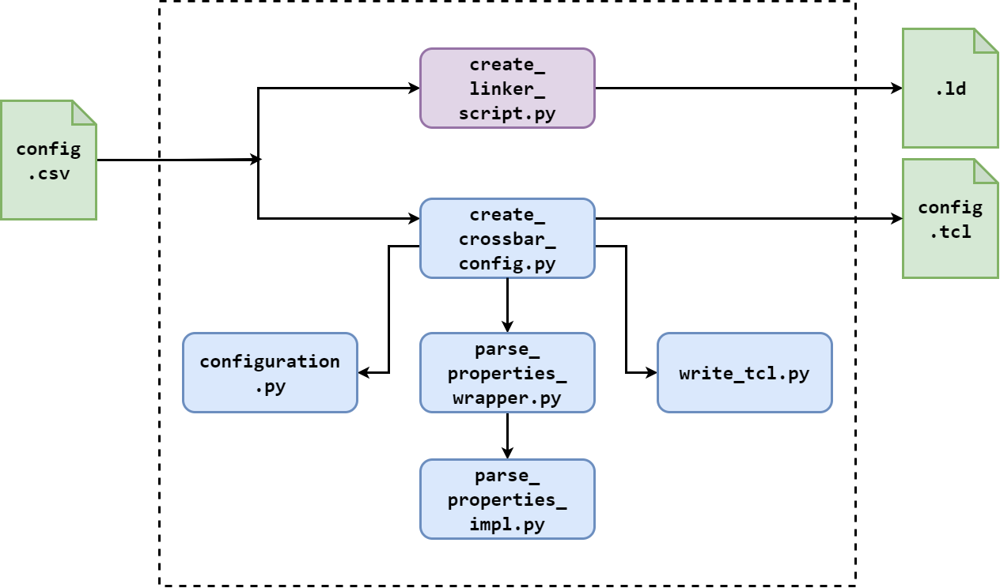

#  AXI Crossbar Configuration Generator
This tree allows for the automatic generation of the AXI crossbar IP and linker script for software development.

## Prerequisites and Tools versions
This tree has been verified with the following tools and versions
* Vivado 2022.2
* AXI Interconnect v2.1
* Pyhton >= 3.10
* Pandas >= 2.2.3

##  Configuration file format
The input configuration file is a CSV file. Each row of this file holds a property name and value pair.
Some properties are array, with elements separated by a space " " character. The following table details the supported properties.

> **IMPORTANT NOTE**: For now, addresses are not sanitized! Hence, in case of overlaps or width-related misconfiguration, the interconnect might not be fully funcional.

| Name  | Description | Values | Default
|-|-|-|-|
| PROTOCOL              | AXI PROTOCOL                                              | (AXI4, AXI4LITE, AXI3)                                    | AXI4
| CONNECTIVITY_MODE     | Crossbar Interconnection                                  | Shared-Address, Multiple-Data(SAMD), Shared-Address/Shared-Data(SASD)                | SAMD
| ADDR_WIDTH            | AXI Address Width                                         | (12..64) for AXI4 and AXI3, (1..64) for AXI4LITE          | 32
| DATA_WIDTH            | AXI Data Width                                            | (32, 64, 128, 256, 512, 1024) for AXI4 and AXI3, (32, 64) for AXI4LITE | 32
| ID_WIDTH              | AXI ID Width                                              | (4..32)                                                   | 4
| NUM_MI                | Number of Master Interfaces (number of slaves)            | (0..16)                                                   | 2
| NUM_SI                | Number of Slave Interfaces (number of masters)            | (0..16)                                                   | 1
| SLAVE_NAMES           | Slave names                                               | [NUM_SI] Strings                                          | N/A
| ADDR_RANGES           | Number of ranges for master interfaces                    | (1..16)                                                   | 1
| BASE_ADDR             | The Base Addresses for each range of each Master          | [NUM_MI*ADDR_RANGES] 64 bits hex                          | 0x100000 for the first range of every Master, otherwise is 0xffffffffffffffff [not used], it must be lesser or equal of Global ADDR_WIDTH
| RANGE_ADDR_WIDTH      | Number of bytes covered by each range of each Master      | [NUM_MI*ADDR_RANGES] (12..64) for AXI4 and AXI3, (1..64) for AXI4LITE | 12 for the first range of every Master, otherwise is 0 [not used]
| READ_CONNECTIVITY     | Master to slave read connectivity                         | [NUM_MI*NUM_SI] not enabled (0), enabled (1)              | 1
| WRITE_CONNECTIVITY    | Master to slave write connectivity                        | [NUM_MI*NUM_SI] not enabled (0), enabled (1)              | 1
| STRATEGY              | Implementation strategy                                   | Minimize Area (1), Maximize Performance (2)               | 0
| Slave_Priority        | Scheduling Slave Priorities                               | [NUM_SI] (0..16)                                          | 0 which is Round-Robin
| SI_READ_ACCEPTANCE    | Number of concurrent Read Transactions for each Slave     | [NUM_SI] (1..32)                                          | 2, only 1 with SASD [forced by STRATEGY, Connectivity Mode and R_REGISTER choices]
| SI_WRITE_ACCEPTANCE   | Number of concurrent Write Transactions for each Slave    | [NUM_SI] (1..32)                                          | 2, only 1 with SASD [forced by STRATEGY, Connectivity Mode and R_REGISTER choices]
| THREAD_ID_WIDTH       | Number of ID bits used for Thread ID for each Slave       | [NUM_SI] (0..32)                                          | 0 is default, at the moment it’s forced to 0
| SINGLE_THREAD         | Support for multiple Threads for each Slave               | [NUM_SI] Multiple Threads (0), Single Thread (1)          | 0
| BASE_ID               | ID Base value for each Slave                              | [NUM_SI] (0x0..0xffffffff)                                | N/A
| MI_READ_ISSUING       | Number of concurrent Read Transactions for each Master    | [NUM_MI] (1..32)                                          | 4, only 1 with AXI4LITE and AXI3 [forced by PROTOCOL]
| MI_WRITE_ISSUING      | Number of concurrent Write Transactions for each Master   | [NUM_MI] (1..32)                                          | 4, only 1 AXI4LITE and AXI3 [forced by PROTOCOL]
| SECURE                | SECURE Mode for each Master                               | [NUM_MI] Non-SECURE (0), SECURE (1)                       | 0
| R_REGISTER            | Read channel register slice                               | None (0), Full (1), Light(8), Automatic (8)               | 0, 1 only with SASD [forced by STRATEGY]
| AWUSER_WIDTH          | AXI AW User width                                         | (0..1024)                                                 | 0
| ARUSER_WIDTH          | AXI AR User width                                         | (0..1024)                                                 | 0
| WUSER_WIDTH           | AXI  W User width                                         | (0..1024)                                                 | 0
| RUSER_WIDTH           | AXI  R User width                                         | (0..1024)                                                 | 0
| BUSER_WIDTH           | AXI  B User width                                         | (0..1024)                                                 | 0

## Genenerate Configurations
To generate configurations, set the `CONFIG_CSV` envvar to a config file and run:
``` bash
$ make config_axi # generates AXI crossbar config
$ make config_ld # generates linker script
```

# Scripting Architecture
The configuration scripting architecture is structured as in the following figure:



* Linker script generation is handled solely by `create_linker_script.py` source.
* TCL file generation is divided in multiple files, with `create_crossbar_config.py` as master script

### How to add a new property
To add a new property:
1. In the target CSV file, e.g. `config.csv`, add the new key-value pair.
2. In file `configuration.py`, add the new property to the config class. Name must match the key in `config.csv`.
3. In file `parse_properties_wrapper.py`, file add a case that composes the new function call.
4. In file `parse_properties_impl.py`, add a function that handles the new property:
    - how it is parsed.
    - how it is sanitized.
    - how it updates the `configuration` structure.
5. In file `create_crossbar_config.py` file, after the loop setting the `configuration` structure,
create the tcl property string and add it to the list of commands, which will then be flushed on the output file.
