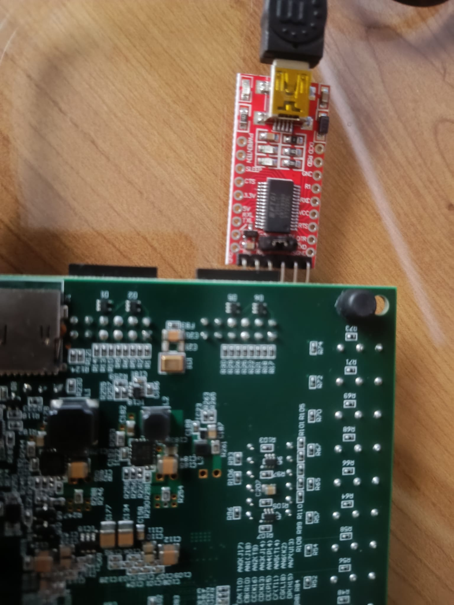
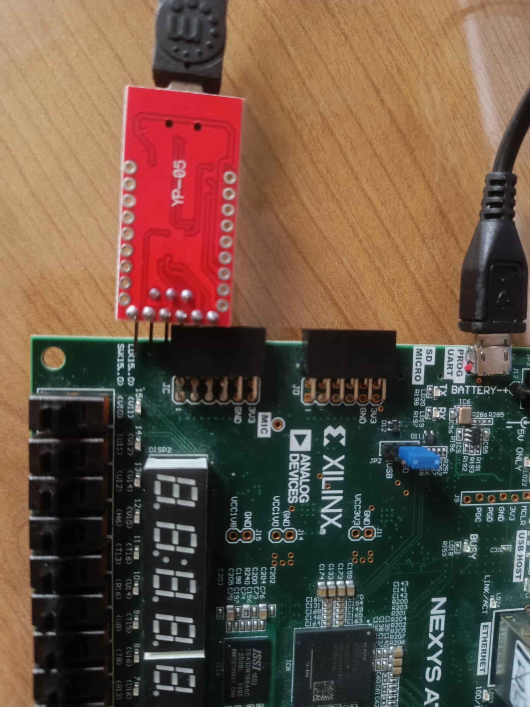

# Uart Connection

The UART peripheral is available in both `hpc` and `embedded` configurations. The `hpc` configuration virtualizes the serial protocol over PCIe, whereas the `embedded` configuration maps the `rx` and `tx` signals to physical output ports. Currently, only Nexys boards are supported for the `embedded` profile. This document outlines how to connect a UART transceiver to UninaSoC.

By default, the UART `rx` and `tx` signals are mapped to PMOD port C, as defined in [`synth/constraints/Nexys-A7-*T-Master.xdc`](../synth/constraints). We use an [FDTI FT232R USB UART transceiver](https://ftdichip.com/wp-content/uploads/2020/08/DS_FT232R.pdf) to connect UninaSoC UART to an external terminal via a USB serial connection (see reference picture).

Nexys to FTDI front        |  Nexys to FTDI back
:-------------------------:|:-------------------------:
  |  

Any compatible FTDI device can be used, provided the UART pins are correctly connected.
In the current implementation, the UART operates at a baud rate of 9600. For further details on the UART hardware configuration, refer to `hw/ips/embedded/xlnx_axi_uartlite/config.tcl`.

